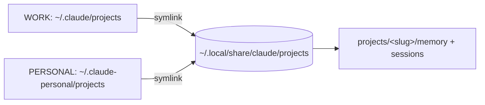

# Unify Claude projects store across profiles

## Problem

Two Claude Code profiles run on this machine: the default profile at `~/.claude` (statusline `WORK`) and the personal profile at `~/.claude-personal` (`CLAUDE_CONFIG_DIR`, statusline `PERSONAL`).
Each profile stores per-project state, including the file-based memory system, under `$CLAUDE_CONFIG_DIR/projects/<slug>/`.
When both profiles work the same checkout they compute the same `<slug>` but write to separate `projects/<slug>/` trees, so neither sees the other's memory.
This is a split-brain: facts learned in one profile are invisible to the other.

The user already worked around this once by hand, symlinking `~/.claude-personal/projects/-home-moritz-dev-repos-materialize/memory` to the default profile's copy.
That fix is manual, per-project, unmanaged by chezmoi, and does not extend to new projects.

## Goal

Both profiles share one projects store keyed by `<slug>`, managed entirely from the chezmoi source tree, with no per-project maintenance and no runtime hook.
Sharing covers the whole `projects/<slug>/` tree (memory plus session transcripts), not memory alone.
Sharing is keyed by exact `<slug>`, so a given checkout unifies across profiles while distinct git worktrees keep separate stores.

## Design

### Structure

A neutral store holds the real data; both profiles' `projects/` become symlinks to it.

```
~/.local/share/claude/projects/                 real dir, the single source of truth
  -home-moritz-dev-repos-materialize/
    memory/  <session>.jsonl  todos/ ...

~/.claude/projects           -> ~/.local/share/claude/projects   symlink
~/.claude-personal/projects  -> ~/.local/share/claude/projects   symlink
```

The `<slug>` is derived from the working directory identically in both profiles, so the same checkout resolves to the same `<slug>/` in the store and the split-brain disappears.
Distinct worktrees carry distinct slugs (the `--claude-worktrees-...` suffix), so they resolve to distinct store entries and stay isolated.
This is the "identical paths only" behavior the user selected: unification follows the slug, and the slug already encodes the checkout path.

### Why this location

`~/.local/share/claude` is already bind-mounted writable in the Linux branch of `claude-jail` (`--bind "$HOME/.local/share/claude"`), so nesting the store under it needs no Linux jail change.
A neutral third location is preferred over pointing one profile at the other: it is symmetric, neither profile is privileged, and removing a config dir loses nothing.

### Why symlink the whole `projects/` dir

Symlinking the entire `projects/` dir keys sharing by `<slug>` for free and covers every current and future project with a single declaration per profile.
The rejected alternative, a `SessionStart` hook that symlinks only `memory/` per project, has more moving parts, shares memory only, and must reimplement the exact slug algorithm.

### Components

All three are managed from the chezmoi source tree.

1. `dot_claude/symlink_projects.tmpl` and `dot_claude-personal/symlink_projects.tmpl`.
   Each renders the symlink target `{{ .chezmoi.homeDir }}/.local/share/claude/projects`.
   Same mechanism as the existing `dot_claude-personal/symlink_CLAUDE.md`.
   These declare the desired end state so future `chezmoi apply` detects and corrects drift.

2. `run_once_before_migrate-claude-projects.sh.tmpl`, the one-time data migration.
   chezmoi replacing a non-empty real `projects/` with a symlink would delete session data, so this script is authoritative: it merges existing data into the store and creates the symlinks itself, leaving chezmoi with a no-op diff.
   Steps:
   * Abort if either Claude Code instance is running (see Safety), printing instructions to retry when both are quit.
   * `mkdir -p` the store.
   * Merge `~/.claude/projects` first because it holds the real memory, then `~/.claude-personal/projects` with no-clobber (`cp -an`).
     Same-slug collisions (`materialize`, `chezmoi`) are safe: session `.jsonl` names are unique, and memory is already unified through the user's manual symlink.
   * Resolve and drop the stale internal `.../materialize/memory -> ...` symlink and the adjacent `memory.bak` so the store holds real content.
   * Replace each real `projects/` dir with the symlink to the store.

3. `claude-jail.tmpl` macOS branch.
   Add `(allow file-read* file-write* (subpath "$HOME/.local/share/claude"))`.
   The Linux branch is unchanged because the bind already exists.

### Data flow



## Safety and preconditions

The migration is destructive-adjacent: it moves `projects/` out from under whatever process owns it.
Both profiles are running at design time, and the migrating session itself runs under `~/.claude`, so moving its own `projects/` mid-session would break live `.jsonl` file handles.

Hard precondition: the migration runs only when both Claude Code instances are quit.
The `run_once_before` script self-guards by detecting live Claude Code processes and aborting with instructions rather than proceeding.
Because a `run_once_before` script fires during `chezmoi apply`, this guard prevents an ill-timed apply from corrupting an active session.

## Accepted tradeoffs

These follow from the "whole projects dir" choice and are acceptable to the user.

* `/resume` in each profile lists the other profile's sessions for shared checkouts.
* `.claude.json` (per-profile project metadata and trust) is not merged; the resulting drift is harmless.
* Concurrent same-repo sessions are last-write-wins per memory file, and `MEMORY.md` can race.
  This already holds for the current manual materialize symlink, so sharing does not worsen it.

## Verification

There is no test suite; verification is manual.

* `chezmoi diff` before apply shows the two `projects` symlinks and the jail edit, nothing else surprising.
* After migration, `readlink ~/.claude/projects` and `readlink ~/.claude-personal/projects` both resolve to the store.
* A memory file written under one profile is visible under the other for the same checkout.
* No session `.jsonl` files are lost: file count in the store is at least the pre-migration union across both profiles.
