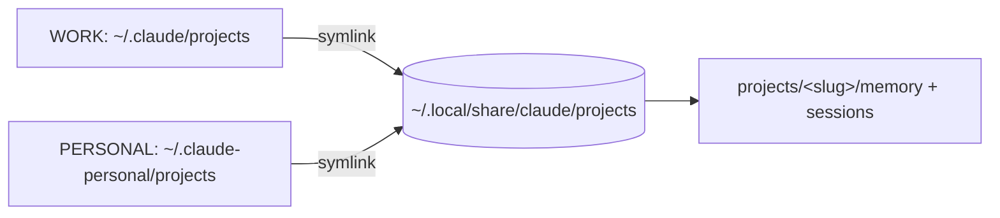

# Unify Claude projects store across profiles

## Problem

Two Claude Code profiles run on this machine: the default profile at `~/.claude` (statusline `WORK`) and the personal profile at `~/.claude-personal` (`CLAUDE_CONFIG_DIR`, statusline `PERSONAL`).
Each profile stores per-project state, including the file-based memory system, under `$CLAUDE_CONFIG_DIR/projects/<slug>/`.
When both profiles work the same checkout they compute the same `<slug>` but write to separate `projects/<slug>/` trees, so neither sees the other's memory.
This is a split-brain: facts learned in one profile are invisible to the other.

The user already worked around this once by hand, symlinking `~/.claude-personal/projects/-home-moritz-dev-repos-materialize/memory` to the default profile's copy.
That fix is manual, per-project, unmanaged by chezmoi, and does not extend to new projects.

## Goal

Both profiles share one projects store keyed by `<slug>`, managed entirely from the chezmoi source tree, with no per-project maintenance and no runtime hook.
Sharing covers the whole `projects/<slug>/` tree (memory plus session transcripts), not memory alone.
Sharing is keyed by exact `<slug>`, so a given checkout unifies across profiles while distinct git worktrees keep separate stores.

## Design

### Structure

A neutral store holds the real data; both profiles' `projects/` become symlinks to it.

```
~/.local/share/claude/projects/                 real dir, the single source of truth
  -home-moritz-dev-repos-materialize/
    memory/  <session>.jsonl  todos/ ...

~/.claude/projects           -> ~/.local/share/claude/projects   symlink
~/.claude-personal/projects  -> ~/.local/share/claude/projects   symlink
```

The `<slug>` is derived from the working directory identically in both profiles, so the same checkout resolves to the same `<slug>/` in the store and the split-brain disappears.
Distinct worktrees carry distinct slugs (the `--claude-worktrees-...` suffix), so they resolve to distinct store entries and stay isolated.
This is the "identical paths only" behavior the user selected: unification follows the slug, and the slug already encodes the checkout path.

### Why this location

`~/.local/share/claude` is already bind-mounted writable in the Linux branch of `claude-jail` (`--bind "$HOME/.local/share/claude"`), so nesting the store under it needs no Linux jail change.
A neutral third location is preferred over pointing one profile at the other: it is symmetric, neither profile is privileged, and removing a config dir loses nothing.

### Why symlink the whole `projects/` dir

Symlinking the entire `projects/` dir keys sharing by `<slug>` for free and covers every current and future project with a single declaration per profile.
The rejected alternative, a `SessionStart` hook that symlinks only `memory/` per project, has more moving parts, shares memory only, and must reimplement the exact slug algorithm.

### Components

All three are managed from the chezmoi source tree.

1. `dot_claude/symlink_projects.tmpl` and `dot_claude-personal/symlink_projects.tmpl`.
   Each renders the absolute symlink target `{{ .chezmoi.homeDir }}/.local/share/claude/projects` with no trailing newline.
   These use the same `symlink_` prefix mechanism as the existing `dot_claude-personal/symlink_CLAUDE.md`, but the concrete form differs: that precedent is a plain (non-template) file holding a relative target (`../.claude/CLAUDE.md`), whereas these are templates holding an absolute target.
   They declare the desired end state so future `chezmoi apply` detects and corrects drift.

2. `run_once_before_migrate-claude-projects.sh.tmpl`, the data migration.
   chezmoi replacing a non-empty real `projects/` with a symlink would delete session data, so this script is authoritative: it merges existing data into the store and creates the symlinks itself, leaving chezmoi a no-op diff for component 1.
   The script is decomposed into ordered steps, each with a success criterion.

   *Step A, guard.*
   Abort with a non-zero exit if any Claude Code process is running (see Safety for the concrete detection and why non-zero is mandatory).
   Success: no live Claude Code process, and the script is not itself a descendant of one.

   *Step B, idempotency short-circuit.*
   A `run_once_before` script re-runs whenever its rendered body hash changes, not only once ever, so a later bugfix edit re-triggers it after the `projects/` dirs are already symlinks.
   If both `~/.claude/projects` and `~/.claude-personal/projects` are already symlinks resolving to the store, exit 0 (nothing to do).
   Success: the script is a no-op on an already-migrated system.

   *Step C, conflict-aware merge.*
   `mkdir -p` the store.
   For each source profile dir that is a real directory (skip any that is already a symlink), merge its contents into the store following symlinks so the store holds real files, never links:
     * a path absent in the store is copied in,
     * a regular file present and byte-identical (`cmp -s`) is skipped,
     * a regular file present but diverging is copied aside as `<name>.conflict-<profile>` and recorded in a conflict log, never silently overwritten.
   Directories present on both sides are recursed into structurally; the byte-identical / conflict rule above applies only to the regular files found during that recursion, not to a directory as a whole (`cmp` errors on a directory, so treating a directory as a comparable unit would false-positive every shared subtree such as `memory/` and `todos/`).
   A dangling symlink encountered while following links (e.g. a future project's broken `memory -> ...`) aborts the migration loudly rather than being copied or skipped, so a broken link is never mistaken for empty content.
   This applies generically to every slug; there is no per-slug special case.
   The literal copy uses merge (not nesting) semantics, e.g. the source is addressed as `dir/.` so contents land at `store/<slug>/...`, not `store/projects/<slug>/...`.
   Success: for every source file, the store holds either that file or a `.conflict-<profile>` sibling; the conflict log lists every divergence.

   *Step D, stale-link and backup cleanup.*
   Generic per-slug rule, not a `materialize` special case: if a slug's `memory` is a symlink in either profile, its resolved target is authoritative and is not re-copied as a separate entry (Step C already follows it to real content); any `memory.bak` sibling is dropped.
   Success: no symlinked `memory` and no `memory.bak` remain in the store.

   *Step E, backup then replace.*
   Only after the store is fully populated, rename each real source dir aside (`projects.pre-migration/`) rather than deleting it, then create the profile symlink to the store.
   The `ln` target string must be byte-identical to the rendered target of component 1, or component 1 stops being a no-op diff.
   Success: `readlink` on both profile `projects` returns the store path; both `projects.pre-migration/` dirs still exist for rollback.

   *Step F, report.*
   Write `migration-report.txt` into the store: per-profile file counts before and after, and the conflict list.
   Success: the report exists and lets the human verification step below run without pre-recorded baselines.

3. `claude-jail.tmpl` macOS branch.
   Add `(allow file-read* file-write* (subpath "$HOME/.local/share/claude"))`.
   The Linux branch is unchanged because the bind already exists.

### Data flow



## Safety and preconditions

The migration is destructive-adjacent: it moves `projects/` out from under whatever process owns it.
Both profiles are running at design time, and the migrating session itself runs under `~/.claude`, so moving its own `projects/` mid-session would break live `.jsonl` file handles.

Hard precondition: the migration runs only from a plain shell with both Claude Code instances quit, never from inside a Claude Code session.
Any `chezmoi apply` invoked from within a session is a descendant of a Claude Code process, so the guard will (correctly) abort it.

Process detection cannot rely on a single fixed string: live sessions appear in more than one shape.
An interactive session's `/proc/<pid>/cmdline` is a bare `claude` (arg0 only, no path, confirmed live on this machine); a headless or remote-control session runs the versioned binary directly as `~/.local/share/claude/versions/<v> --print --sdk-url ...`; a jailed session runs under `bwrap` and its inner process resolves to that same versioned-binary path.
The guard therefore treats a process as a live Claude Code session on Linux if either its arg0 basename is exactly `claude`, or its full command line contains `.local/share/claude/versions/`; the macOS equivalent applies the same two conditions over `ps -eo command`.
No explicit self-exclusion is needed under these two conditions: the migration script runs via its interpreter, so its arg0 basename is `bash` (not `claude`) and its temporary path contains `migrate-claude-projects`, not `.local/share/claude/versions/`; likewise `chezmoi` itself matches neither condition.
The abort message must warn that detached remote-control sessions are not closed by quitting a terminal and must be stopped explicitly.

The guard exits non-zero, which is mandatory, not cosmetic.
A non-zero `run_once_before` exit fails the whole `chezmoi apply`, so component 1's symlinks are not applied and the run is not recorded as done, leaving both `projects/` dirs untouched for a later retry.
If the guard instead exited 0 without migrating, chezmoi would mark the script done and proceed to replace both real `projects/` dirs with symlinks, destroying the data; the non-zero exit is what prevents this.

## Accepted tradeoffs

These follow from the "whole projects dir" choice and are acceptable to the user.

* `/resume` in each profile lists the other profile's sessions for shared checkouts.
* `.claude.json` (per-profile project metadata and trust) is not merged; the resulting drift is harmless.
* Concurrent same-repo sessions are last-write-wins per memory file, and `MEMORY.md` can race.
  This already holds for the current manual materialize symlink, so sharing does not worsen it.

## Verification

There is no test suite; verification is manual, and it runs before the `projects.pre-migration/` backups are removed.

* `chezmoi diff` before apply shows the two `projects` symlinks and the jail edit, nothing else surprising.
* After migration, `readlink ~/.claude/projects` and `readlink ~/.claude-personal/projects` both resolve to the store.
* A memory file written under one profile is visible under the other for the same checkout.
* No files are lost: the store's post-migration file count is at least the pre-migration union recorded in `migration-report.txt`.
* The conflict log is reviewed and every `.conflict-<profile>` file is reconciled or accepted before the `projects.pre-migration/` backups are deleted.
* On a re-run (edited script), the idempotency short-circuit fires and the store is unchanged.
